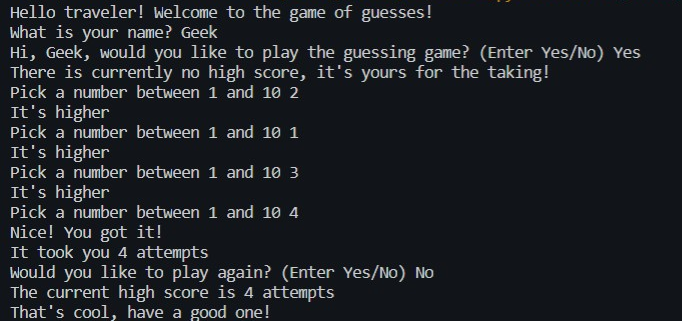

# Number Guessing Game<br>
### Description
Its quite handy to perform a google search using python. It shows the top URLs for the required query.

### Tools and Languages:


<br>

### Installing Libraries
```cmd
pip install random
```
-> Mostly probably you should already have random installed as it comes with python distribution.

### Steps to follow
-Install the given libraries<br>
-Download the code from the given github repository<br>
-Run the code<br>
-HAve fun with the game<br>

### Important function
```python
def start_game():
    random_number = int(random.randint(1, 10))
    print("Hello traveler! Welcome to the game of guesses!")
    player_name = input("What is your name? ")
    wanna_play = input("Hi, {}, would you like to play the guessing game? (Enter Yes/No) ".format(player_name))
    attempts = 0
    show_score()
    while wanna_play.lower() == "yes":
        try:
            guess = input("Pick a number between 1 and 10 ")
            if int(guess) < 1 or int(guess) > 10:
                raise ValueError("Please guess a number within the given range")
            if int(guess) == random_number:
                print("Nice! You got it!")
                attempts += 1
                attempts_list.append(attempts)
                print("It took you {} attempts".format(attempts))
                play_again = input("Would you like to play again? (Enter Yes/No) ")
                attempts = 0
                show_score()
                random_number = int(random.randint(1, 10))
                if play_again.lower() == "no":
                    print("That's cool, have a good one!")
                    break
            elif int(guess) > random_number:
                print("It's lower")
                attempts += 1
            elif int(guess) < random_number:
                print("It's higher")
                attempts += 1
        except ValueError as err:
            print("Oh no!, that is not a valid value. Try again...")
            print("({})".format(err))
    else:
        print("That's cool, have a good one!")
```

### Sample Optput


### Developed by:
<a href="https://github.com/ankush0939">Ankush Mishra</a>

